# 在Genymotion安装QPython

## 一、安装Genymotion

1.注册账号

首先打开[https://www.genymotion.com/account/login](https://www.genymotion.com/account/login),点击** sign in**，注册一个账号。

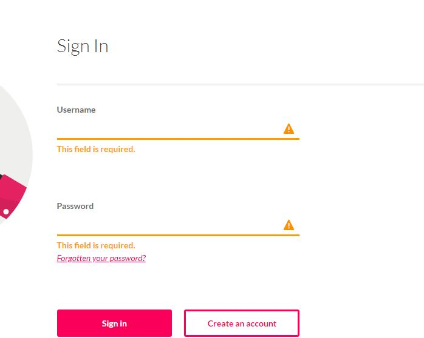

2.下载并安装应用

注册好以后，点击[https://www.genymotion.com/download](https://www.genymotion.com/download),注意要下载** with VirtualBox**。下载好之后就一步一步地安装应用，还要记得安装VirtualBox。

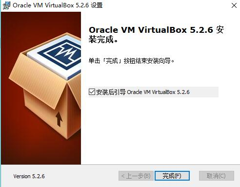

3.打开应用

打开安装好的genymotion,点击** Settings**,再点击** Sign in**,把刚刚注册的信息填上。

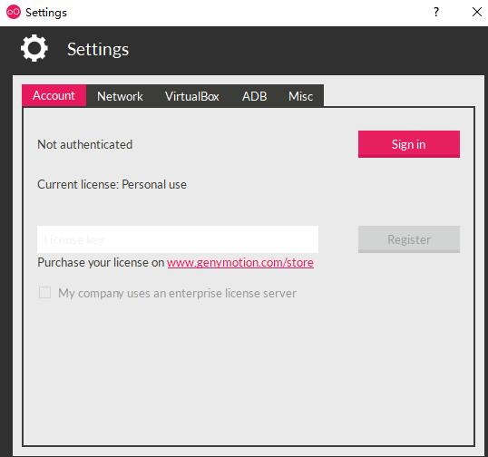

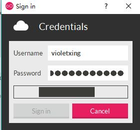

4.设置信息

打开**Setting**，点击**ADB**，在**Browse**里选择安装adb的文件。

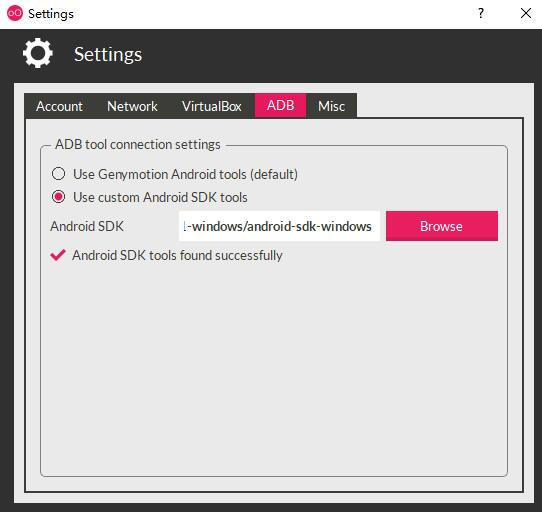

5.添加虚拟机

在**Add**里面找到你喜欢的一款虚拟机，然后双击它，就可以添加属于你的一台虚拟机了。

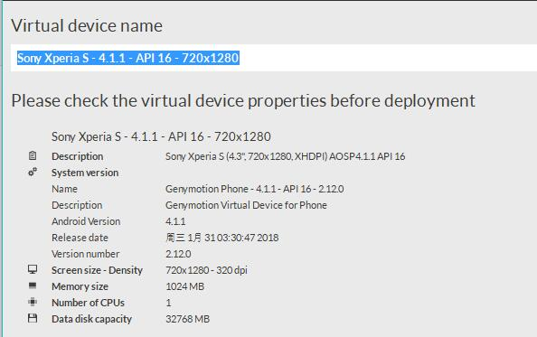


## 二、在虚拟机安装qpthon

* 虚拟机上方有个IP地址，复制下来

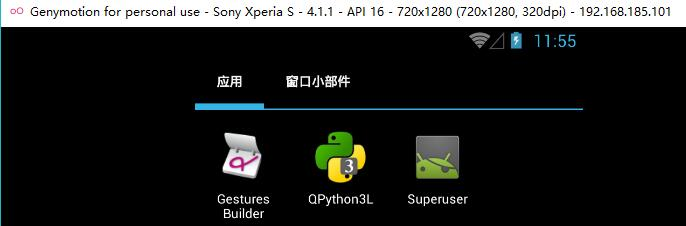

* 用adb连接这个IP地址，```adb connect 192.168.185.101``` 

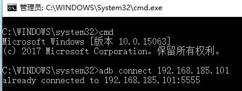

* 查看QPython目录的文件

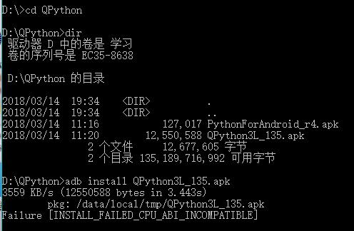

* 安装QPython3L_135.apk，```adb install QPython3L_135.apk```

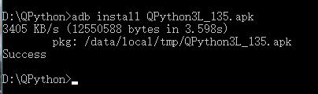

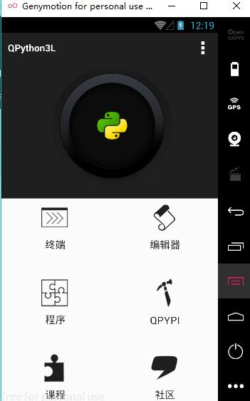

至此就已经安装成功了。