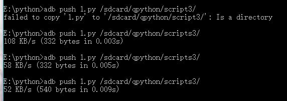

# QPython实现交互界面

1、用Python写出一个交互的界面

```python
import android

droid =android.Android()
droid.dialogCreateAlert("是否提交","请选择单击下面按钮")
droid.dialogSetPositiveButtonText("确定");
droid.dialogSetNeutralButtonText("取消");
droid.dialogSetNegativeButtonText("退出");
droid.dialogShow()

result = droid.dialogGetResponse().result
print(result)
```


2、adb连接模拟器（夜神模拟器端口号为62001）


用adb将这个文件上传到虚拟机里



打开虚拟器，找到写好的文件并运行。


3、弹出一个窗口，当你点击“确定”，会出现以下界面


点击“取消”，出现以下界面


点击“退出”，出现以下界面


4、改进过后的python文件

```python
import android

droid =android.Android()
droid.dialogCreateAlert("是否提交","请选择单击下面按钮")
droid.dialogSetPositiveButtonText("确定");
droid.dialogSetNeutralButtonText("取消");
droid.dialogSetNegativeButtonText("退出");
droid.dialogShow()

result = droid.dialogGetResponse().result
# print(result)
if result['which']=='positive':
    print('单击了确定按钮')
elif result['which']=='neutral':
    print('单击了取消按钮')
elif result['which']=='negative':
    print('单击了退出按钮')

    
```


点击“确定”，会出现以下界面


点击“取消”，出现以下界面


点击“退出”，出现以下界面


